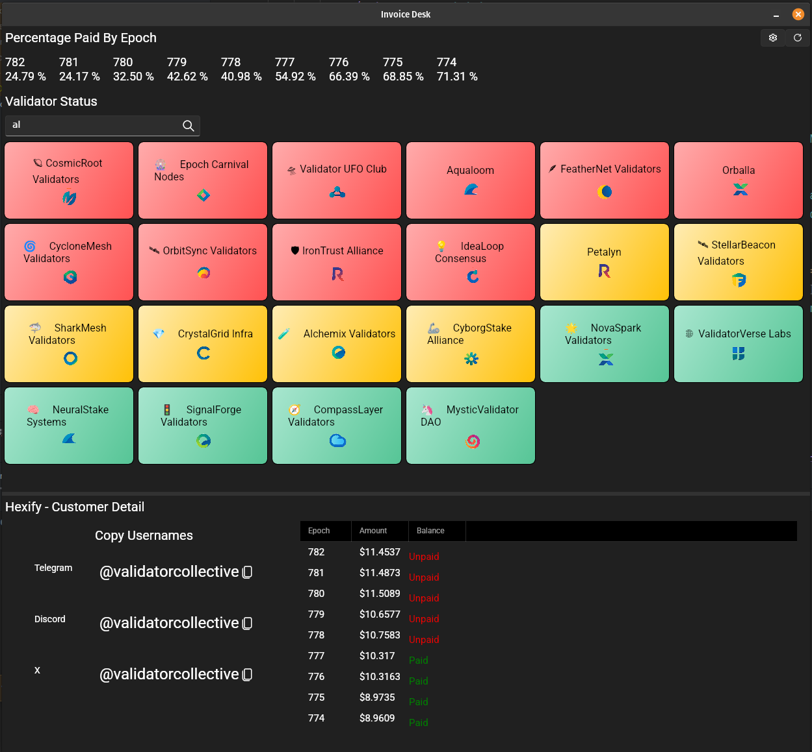

# Invoice Desk

**A cross-platform internal tool for managing invoices and customer contact information, built with .NET 9 and Avalonia UI.**

## Overview

**InvoiceDesk** is a modern example of a desktop application using [Avalonia UI](https://avaloniaui.net/), developed to demonstrate how internal business tools can be elegant, secure, and highly functional. Designed around a custom invoicing system, this tool links invoices with customer contact data — without ever exposing that information to the web.

Built with .NET 9, this project highlights how to structure a cross-platform, high-performance desktop app using C#, MVVM, and Avalonia.

## Key Features

- **Privacy-first, internal use** – Customer data stays local to your machine. No server, no cloud sync, no risk.
- **Highlights important data** – Shows most important invoices with color coding and sorting, while allowing selecting for detailed views.
- **Contact integration** – Maintain customer details with clean data entry and linking to invoices.
- **Cross-platform desktop app** – Runs on Windows, macOS, and Linux with native look and feel.
- **MVVM architecture** – Designed with maintainability and testability in mind.
- **Dynamic Data Filtering** – Uses Dynamic Data Source Cache for efficient item filtering and sorting.
- **Lightweight, fast startup** – Built with Avalonia and .NET 9 for a fast, modern experience.

## Why Desktop?

This is a tool built for internal use. There's no web front end, just a fast, secure desktop app where all sensitive customer data stays local — perfect for teams that need to protect their information without the hassle of public facing website security management. 

## Tech Stack

- **.NET 9** – Cutting-edge performance, long-term stability
- **Avalonia UI** – Cross-platform XAML UI framework
- **CommunityToolkit.MVVM** – Clean MVVM pattern
- **JetBrains Rider** – Primary development environment

## Screenshots



## Getting Started

Clone the repo and run the app:

```bash
git clone https://github.com/fuzzyyti/invoicedesk.git
cd invoicedesk
dotnet run
```

To publish a standalone build:

```bash
dotnet publish -c Release -r win-x64 --self-contained
You can swap win-x64 for osx-arm64 or linux-x64 as needed.
```

License
MIT


